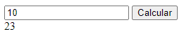
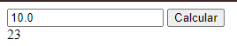
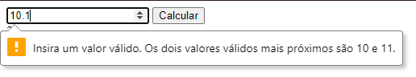
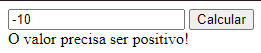
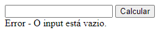

# primeiro-desafio-escribo
Implementando uma função que irá receber um número inteiro positivo e retorne o somatório de todos os valores inteiros divisíveis por 3 ou 5 que sejam inferiores ao número passado.

## :computer: Como rodar ?

### Primeira etapa.
Entrar na pasta do repositório e abrir o cmd nela.

### Segunda etapa.
Depois que estiver no cmd, execute o seguinte linha de comando: 

	php -S localhost:8000
      
O servidor estará rodando e o arquivo que está aberto é o **index.php**.

### Terceira etapa.
Com a página aberta, hora de colocar os dados.

## :man_technologist: Alguns testes que eu fiz.

### Quando coloquei um valor inteiro:

### Quando coloquei um valor decimal, mas que não tem valor após a vírgula:

### Quando coloquei um valor decimal:

### Quando coloquei um valor negativo:

### Quando não coloquei valor:

